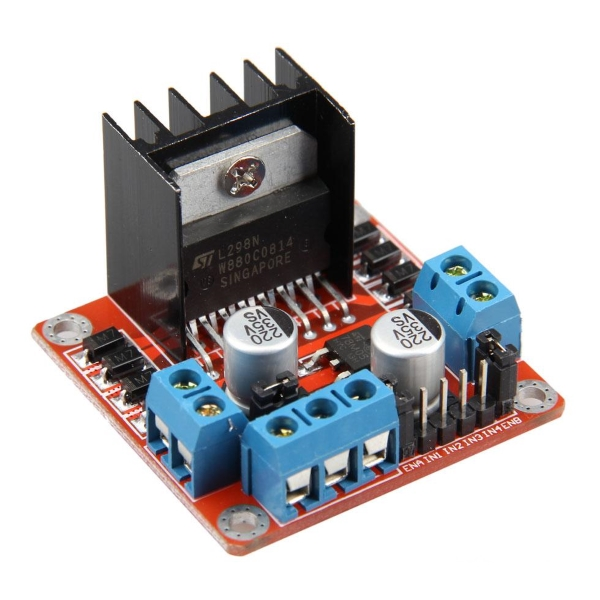

Esta Biblioteca foi contruída para facilitar a implementação e minimizar a quantidade de código quando trabalhar com o Driver Ponte H, baseado no chip L298N, construído para controlar cargas indutivas como relés, solenoides, motores DC e motores de passo. Com este Driver Ponte H L298N é possível controlar independentemente a velocidade e rotação de 2 motores DC ou 1 motor de passo.

Esse hardware possui terminais parafusáveis para fácil instalação e buracos nas extremidades da placa para fixação.



Especificações:
- Tensão de Operação: 4~35v
- Chip: ST L298N
- Controle de 2 motores DC ou 1 motor de passo
- Corrente de Operação máxima: 2A por canal ou 4A max
- Tensão lógica: 5v
- Corrente lógica: 0~36mA
- Limites de Temperatura: -20 a +135°C
- Potência Máxima: 25W
- Dimensões: 43 x 43 x 27mm
- Peso: 30g

## Instalação

1. "Download":https://github.com/rodriguesfas/DMPH_L298N/archive/master.zip ;
2. Descompacte e modifique o nome da pasta para: "DMPH_L298N" (Remova o '-master');
3. Importe-a para sua pasta Library da sua IDE Arduino ou o diretório sketchbooks do Arduíno software;
4. Restart Arduino IDE.

## Sintáxe
```c++
// Instância um objeto chamado motor, passando por parâmetros os pinos de conexão onde esta ligado o motor (pin_motor, pin_motor, pin_motor_velocidade).
DMPH motor(2, 4, 3);
```

```c++
// liga motor com passagem de parâmetro 'h' -> Sentido da rotação horária e 100 -> valor da velocidade de rotação.
motor.ligar('h', 100);

// liga motor com passagem de parâmetro 'a' -> Sentido da rotação antioraria e 100 -> valor da velocidade de rotação.
motor.('a', 100);

// desliga moto
motor.desligar();
```

## Exemplo
Veja um exemplo de como tudo fica mais simples e enxuto:
https://github.com/rodriguesfas/DMPH_L298N/blob/master/examples/DMPH_L298N_Simples/DMPH_L298N_Simples.ino

## Dicas e avisos

## Referência Biblioteca
